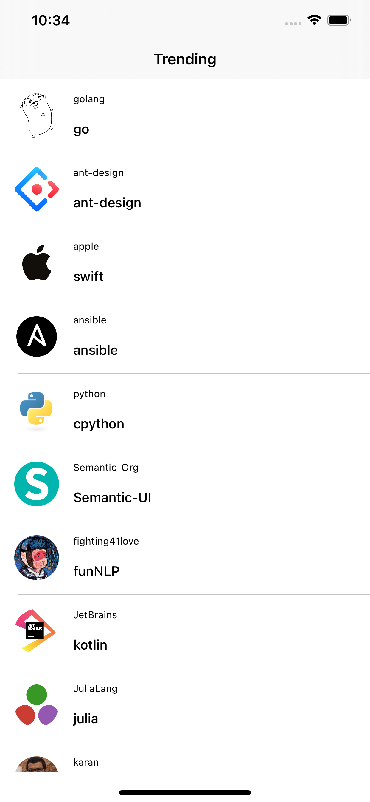
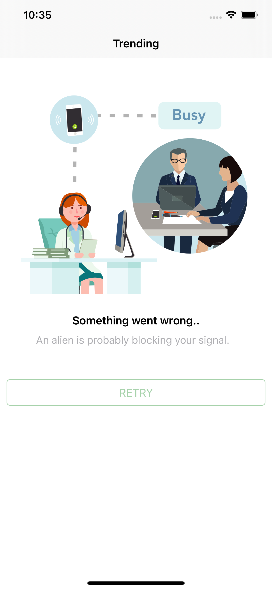

# GitTrending(TDD)

This application has been implemented using TDD with UIKit and Swift Combine.

## Features

- [x] Shimmer Loading
- [x] Show latest git trending repositories.
- [x] On fail call the retry will be shown.
- [x] Pull to refresh to get the latest data from the api.

## View States
<table>
  <tr>
    <td>Loading Shimmer</td>
    <td>Trending Repositories</td>
    <td>Retry</td>
  </tr>
  <tr>
  <td></td>
    <td></td>
    <td></td>
   </tr>
 </table>

## Technical Details

- [x] Modular based architecture (Network Feature)
- [x] TDD
- [x] MVVM with clean using coordinator pattren
- [x] Using of combine

## Requirements

- iOS 13+ 
- Xcode 14+
- Swift 5.5+
- SPM

